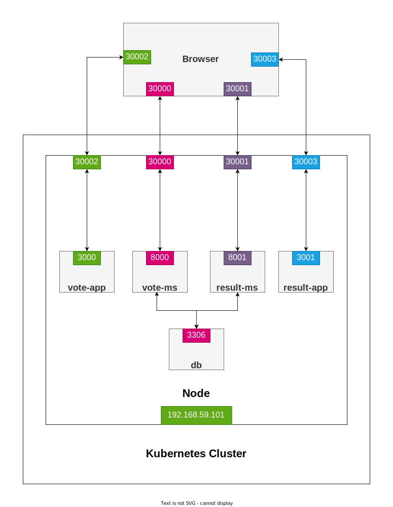

# Microservices in Kubernetes



# Creating images for Kubernetes

* Changing the IP and PORT

Before:
```
- REACT_APP_VOTE_MS_HOST=http://localhost
- REACT_APP_VOTE_MS_PORT=8000
---
- REACT_APP_RESULT_MS_HOST=http://localhost
- REACT_APP_RESULT_MS_PORT=8001
```

After:
```
- REACT_APP_VOTE_MS_HOST=http://myapp
- REACT_APP_VOTE_MS_PORT=30000
---
- REACT_APP_RESULT_MS_HOST=http://myapp
- REACT_APP_RESULT_MS_PORT=30001
```

* Rebuild the images

```bash
docker-compose build
```

* Push the new images

```bash
docker-compose push
```

# Deploying the application

* Creating pods

```bash
for i in kube/pods/*.yml; do kubectl create -f "$i"; done
```

* Creating services

```bash
for i in kube/services/*; do kubectl create -f "$i"; done
```

* Getting the minikube IP address

```
minikube ip
```

* Adding the domain name

**/etc/hosts**

```bash
192.168.59.101      myapp
```
