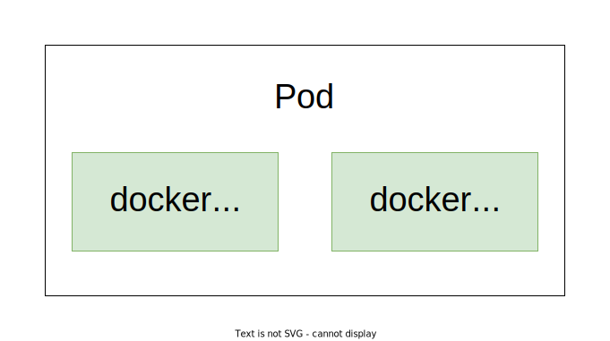
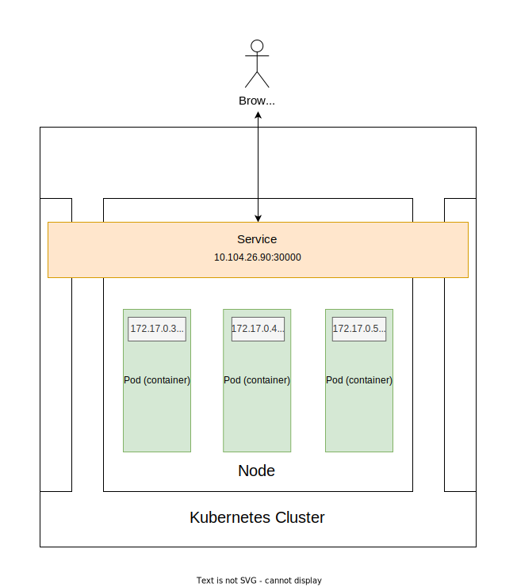

# Introduction to Kubernetes

* Containerizing (Docker)
* Pods
* Service
* ReplicaSet
* Deployment

# Containerizing the application

* Creating the image
```bash
# docker build . -t <name>:<tag>
docker build . -t ku:1.0
```

* Running the image
```bash
# docker run -p <host_port>:<container_port> -d <name>:<tag>
docker run -p 80:80 -d ku:1.0
```

* Publishing the docker image
```bash
# docker tag <curr_name>:<curr_tag> <username>/<name>:<tag>
docker tag ku:1.0 s1n7ax/ku:1.0

docker login

# docker push <username>/<name>:<tag>
docker push s1n7ax/ku:1.0
```

# Pods

A pod is the smallest execution unit in Kubernetes. A pod encapsulates one or more applications.



* Creating pod
```bash
# kubectl create -f <pod_definition_file>
kubectl create -f pod.yml
```

* List all pods
```bash
kubectl get pods
```

* Deleting pod
```bash
# kubectl delete pod <name>
kubectl delete pod ku
```

# Service (NodePort)



* Creating service
```bash
kubectl create -f nodeport-service.yml
```

* Getting access URL within the cluster
```bash
# kubectl get service <name>
kubectl get service ku
```

* Getting access URL from minikube
```bash
# minikube service <name> --url
minikube service ku --url
```

* Removing service
```bash
# kubectl delete service <name>
kubectl delete service ku
```

# ReplicaSet

The ReplicaSet creates Pods in the background.

* Creating replica set
```bash
kubectl create -f replicaset.yml
```

* Get all replica sets
```bash
kubectl get rs
```

* Deleting replica set
```bash
# kubectl delete rs <name>
kubectl delete rs ku
```

# Deployment

A Kubernetes Deployment is used to tell Kubernetes how to create or modify instances of the pods that hold a containerized application.

* Creating deployment
```bash
kubectl create -f dep.yml
```

* Update application
```bash
docker build . -t ku:2.0
docker tag ku:2.0 s1n7ax/ku:2.0
docker push s1n7ax/ku:2.0
```

* Update deployment
```bash
kubectl apply -f dep.yml
```

* Get rollout history
```bash
# kubectl rollout history deployment <name>
kubectl rollout history deployment ku
```

* Undo rollout
```bash
# kubectl rollout undo deployment <name>
kubectl rollout undo deployment kr
```

* Undo rollout to revision
```bash
# kubectl rollout undo deployment <name> --to-revision <revision> 
kubectl rollout undo deployment kr --to-revision 4
```
